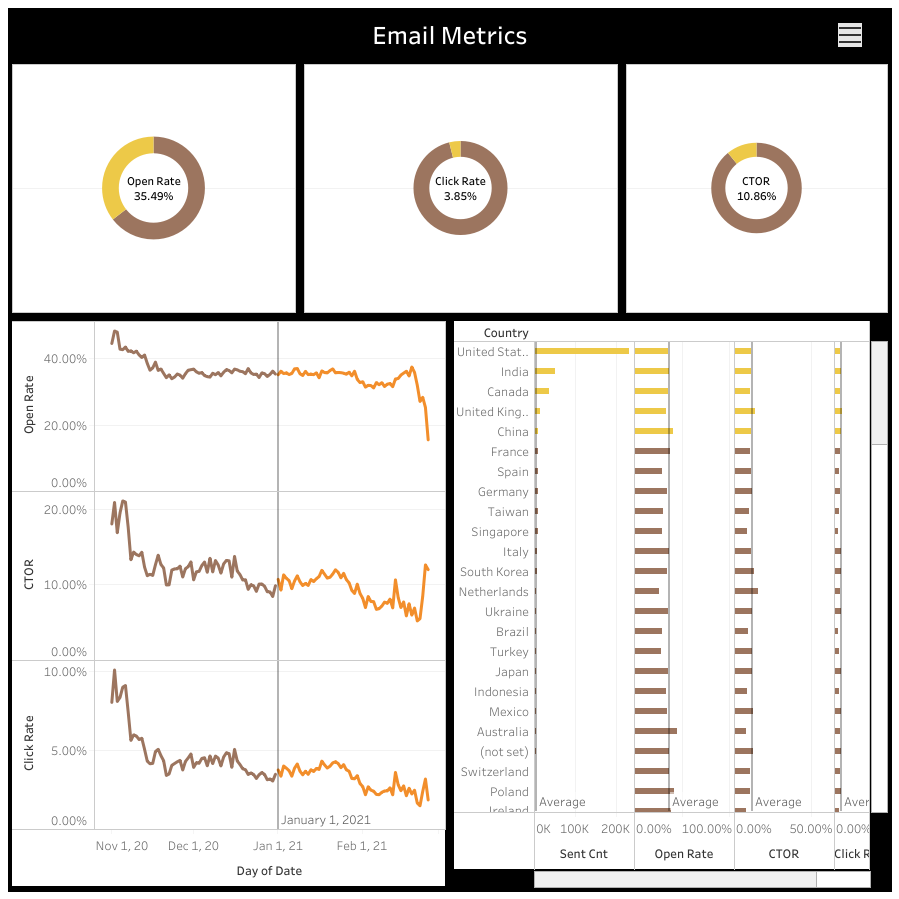

# 📧 Dashboard Email Metrics - Tableau

Dashboard desenvolvido no **Tableau** para análise de métricas de campanhas de e-mail marketing, com foco em performance, engajamento e comportamento por região.

## 📌 Objetivo

Monitorar os principais indicadores de campanhas de e-mail e transformar dados em insights visuais para apoiar decisões estratégicas.

## 📊 KPIs analisados

* Open Rate
* Click Rate
* CTOR (Click-to-Open Rate)
* Total de e-mails enviados
* Evolução temporal das métricas
* Performance por país

## 🛠️ Ferramentas utilizadas

* Tableau
* SQL
* GitHub

## 🖼️ Dashboard Preview

## 📈 Insights obtidos

* Países com maior taxa de abertura e clique
* Tendência de queda ou crescimento no engajamento
* Comparação entre envio, abertura e clique
* Identificação de oportunidades de otimização

## 📂 Estrutura do projeto

dashboard-email-metrics-tableau/
├── images/
│   └── emails_metrics_tableau_dashboard.png
├── emails_metrics_tableau.sql
└── README.md

## 🚀 Autor

Fernando Filho
